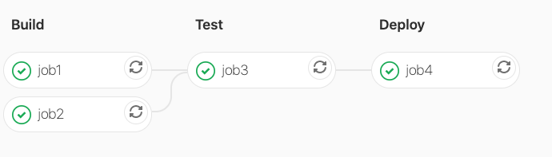
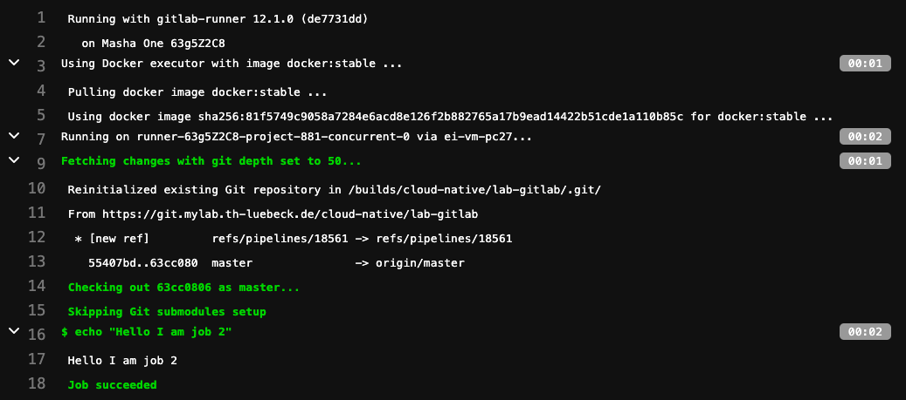
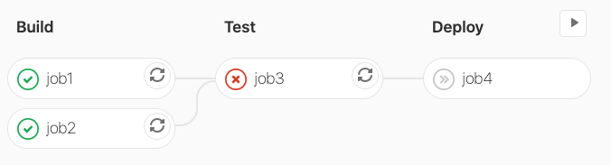

# Lab: Deployment Pipelines as Code

Deployment Pipelines sind ein wesentlicher Baustein im DevOps Ansatz, um Entwicklungszyklen schnell und agil zu halten.
Ziel ist es, Code der in ein Code Repository eingebracht wird, möglichst automatisiert zu integrieren, bauen, testen
sowie ggf. in eine Umgebung (häufig Test, Staging, Production) auszubringen.

Mit jedem Code Push wird also automatisiert geprüft, ob der Code in die bestehende Codebasis integriert werden kann, compilierbar ist, alle Tests passiert und deploybar ist. Auf diese Weise können nur funktionierende Softwarezustände in funktionierende Softwarezustände überführt werden. Entwickler sind so nicht einmal in der Lage Code zu erzeugen, der nicht automatisiert durch die Deployment Pipeline verarbeitbar ist.

Gemäß dem Everything as Code Ansatz versucht man auch Deployment Pipelines als versionierbaren Code ausdrücken zu können.
Es gibt diverse solcher Managed oder Self-hosted Services, die als kommerzielle oder auch als Open Source Software genutzt werden können. Z.B.:

- GitLab CI
- Circle CI
- Travis CI
- Jenkins
- Bitbucket Pipelines
- und viele mehr

Da Gitlab als Open Source Lösung einfach installiert werden kann, werden wir das Prinzip einer Deployment Pipeline
as Code am Typvertreter Gitlab CI demonstrieren. Die Ansätze anderer CI/CD Dienste funktionieren aber nach sehr
vergleichbaren Konzepten. Die Wahl auf Gitlab CI als Typvertreter erfolgt schlicht und ergreifend auf Basis der
guten Verfügbarkeit von Gitlab als Open Source Software und dessen häufigen Einsatz in Cloud-native Kontexten.

Wer mag, kann dieses Lab auch mittels des Managed Service Gitlab.com nachvollziehen. Hierzu müssen Sie sich allerdings
registrieren.

## Inhalt

- Erzeugung einer Build-Pipeline mittels einer Sequenz von Stages
- Parallele Ausführung von Jobs innerhalb einer Stage, sequentielle Ausführung der einzelnen Stages
- Weiterreichen von Artifacts zwischen Stages
- Informationen in die Build-Pipeline mittels [Environment Variables](https://docs.gitlab.com/ee/ci/variables/predefined_variables.html) geben.
- Nutzung von Images
- Bereitstellung von Images
- Deployments to Kubernetes
- Deployments to Serverless Environments

### Übung 1: Erzeugung von Deployment Pipelines

Eine Deployment Pipeline besteht aus einer Sequenz von Stages. Jede Stage kann ein oder mehrere Jobs haben. Alle Jobs innerhalb einer
Stage werden parallel und isoliert voneinander ausgeführt. Eine Stage wird nur dann ausgeführt, wenn alle Jobs der vorherigen Stage
erfolgreich ausgeführt werden konnten.

Eine typische Pipeline umfasst häufig die folgenden Stages (grundsätzlich können Pipelines beliebig aussehen, es bietet sich jedoch an bewährten Pipeline Blueprints zu folgen):

- build (zum Erzeugen von Executables)
- test (zum Testen von Executables)
- deploy (zum Ausbringen von Executables)

Solch eine einfache Deployment Pipeline wollen wir nun bauen. Führen Sie hierzu bitte die folgenden Schritte aus:

__Aufgaben:__

1. Forken Sie hierzu bitte dieses Repository in Gitlab.
2. Sie finden in diesem geforkten Repository eine leere `.gitlab-ci.yml` Datei an. Diese Datei definiert Ihre Pipeline, die Gitlab mit jedem Push in das Repository automatisch anstößt.
3. Fügen Sie in diese Datei nun bitte folgende Inhalte ein und committen+pushen Sie `.gitlab-ci.yml` in das Repository:

    ```yaml
    stages:
        - build
        - test
        - deploy

    job1:
        stage: build
        script:
            - echo "Hello I am job 1"

    job2:
        stage: build
        script:
            - echo "Hello I am job 2"

    job3:
        stage: test
        script:
            - echo "Hello I am job 3"

    job4:
        stage: deploy
        script:
            - echo "Hello I am job 4"
    ```
4. Gitlab führt dann automatisch, die so definierte [Pipeline](../../../pipelines) aus.
   
   
5. Klicken Sie auf einen dieser Jobs, dann erhalten Sie den Konsolenoutput des Jobs.
   
   

Eine Pipeline ist also sehr einfach mit einer YAML Datei definierbar. YAML Dateien wiederum sind gut durch Code Versionssysteme versionierbar.
Das ist eigentlich auch schon das wesentliche Prinzip von einer Deployment Pipeline as Code. Sie sehen an diesem Beispiel allerdings auch bereits weitere Aspekte die typisch für Cloud-native Deployment Ansätze sind.

- Jobs sind eigentlich nichts weiter als Shellskripte, die in einem isolierten Container ausgeführt werden.
- Können alle Jobs einer Stage erfolgreich ausgeführt werden, (exit code == 0) werden die Jobs der nächsten Stage gestartet.
- Schlägt ein Job fehl (exit code != 0), wird die nächste Stage nicht gestartet. Sie können das ganz einfach ausprobieren, indem Sie bspw. den Befehl `exit 1` in *job3* ergänzen.
    ```yaml
    job3:
        stage: test
        script:
            - echo "Hello I am job 3"
            - exit 1
    ```
    Die Pipeline schlägt dann in job3 in Stage `test` fehl.

    

### Übung 2: Weiterreichen von Job Erzeugnissen

Jobs laufen isoliert in einem Container ab, sind also zustandslos oder anders ausgedrückt: Jobs "vergessen" erzeugte Artifakte. Dies ist sicherlich in vielen Fällen nicht sinnvoll.
Z.B. sollten durch den Compiler erzeugte `.class` Dateien in einem Java Build Schritt an einen Test Job weitergereicht werden können (ansonsten müsste der Test Job erneut kompilieren).
Zum Ende der Pipeline soll vielleicht auch eine `jar`-Datei als Endergebnis der Pipeline bereitgestellt werden können.

Hierfür dienen in Pipelines sogenannte Artefakte. Artefakte sind Job Erzeugnisse, die zwischen Jobs entlang einer Stage Sequenz fließen.

__Aufgabe__:

Ändern Sie bitte Ihre Pipeline wie folgt ab:

```yaml
stages:
    - generate
    - consume

job1:
    stage: generate
    script:
        - mkdir build
        - echo "Hello I am job 1" > build/job1-result.txt

job2:
    stage: generate
    script:
        - mkdir build
        - echo "Hello I am job 2" > build/job2-result.txt

job3:
    stage: consume
    script:
        - cat build/*-result.txt
```

Die Jobs job1 und job2 lenken ihre Resultate also in zwei Dateien um, die im `build` Verzeichnis gespeichert werden.
Wir würden an dieser Stelle erwarten, dass der job3 daher folgende Konsolenausgabe erzeugen sollte:

```
Hello I am job1
Hello I am job2
```

Tatsächlich schlägt der job3 aber wie folgt fehl:

```
cat: can't open 'build/*-result.txt': No such file or directory
$ cat build/*-result.txt
ERROR: Job failed: exit code 1
```

Und dies obwohl die Dateien in job1 und job2 korrekt angelegt wurden. Allerdings in einem Container. Und alle Jobs laufen
in isolierten Containern voneinander ab, d.h. job1 kennt job2 und job3 nicht, und job2 kenn job1 sowie job3 nicht, usw.
Wenn man Erzeugnisse eines Jobs anderen Jobs bereitstellen muss innerhalb einer Pipeline, dann kann man dies mittels Artefakten
machen.

Um Artefakte zu kennzeichnen, können Sie folgenden Eintrag den Jobs job1 und job2 hinzufügen.

```yaml
artifacts:
    paths:
    - build/
```

Diese Artefakte stehen dann allen Jobs in der Pipeline zur Verfügung. Sie müssen darauf achten, dass unterschiedliche Jobs
unterschiedlich benannte Artefakte erzeugen, ansonsten überschreiben sich identisch benannte Artefakte gegenseitig.

Auch dies können Sie einmal ausprobieren, indem Sie anstelle von 

```
echo "Hello I am job 2" > build/job2-result.txt
```

folgendes schreiben (also die Job-Nummern in den Artefaktbezeichnern sowohl in Job1 als auch in Job2 entfernen).

```
echo "Hello I am job 2" > build/job-result.txt
```

Dann werden Sie nur eine Ausgabe von job1 oder job2 bekommen. Welche Ausgabe ist davon abhängig welche Job Artifakte von der Pipeline
aus job1 und job2 als letztes gesichert wurden. Gehen Sie davon aus, dass dies nicht deterministisch ist - insbesondere bei parallel ablaufenden Jobs.

## Quellen für weitergehende Informationen:

- Youtube: [Gitlab CI pipeline tutorial for beginners](https://youtu.be/Jav4vbUrqII)
- Youtube: [Gitlab CI Pipeline, Artifacts and Environments](https://youtu.be/PCKDICEe10s)
- Youtube: [Automating Kubernetes Deployments](https://youtu.be/wEDRfAz6_Uw)
- Gitlab: [Job Artifacts](https://docs.gitlab.com/ee/ci/pipelines/job_artifacts.html)


